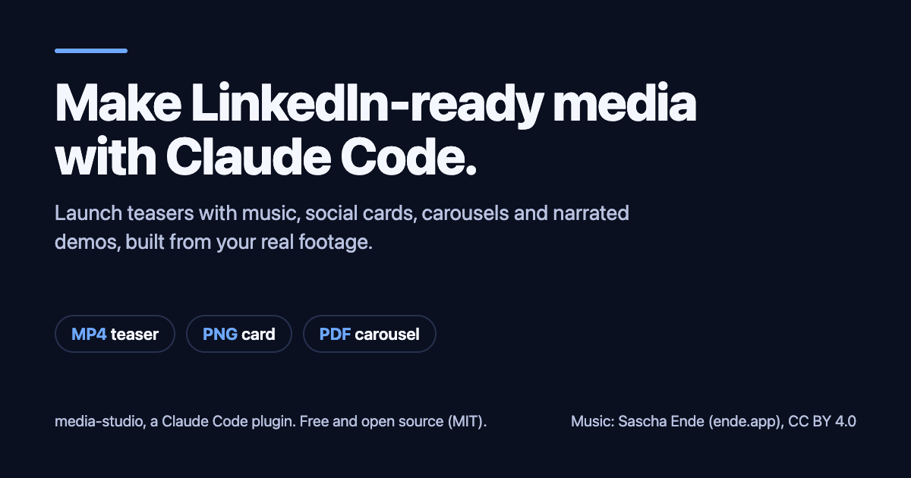
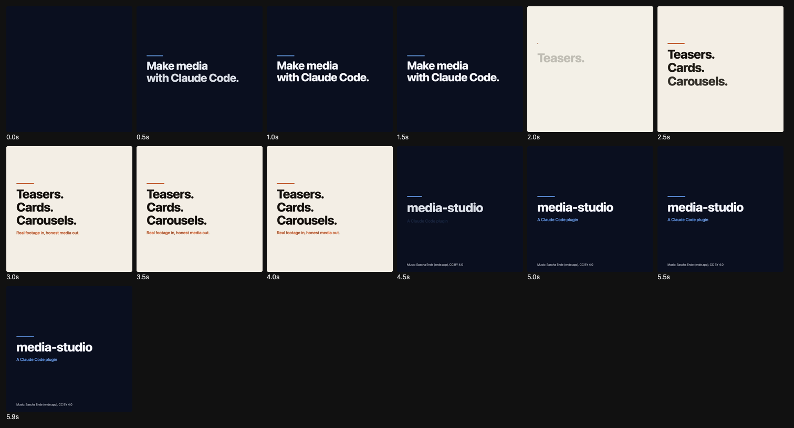
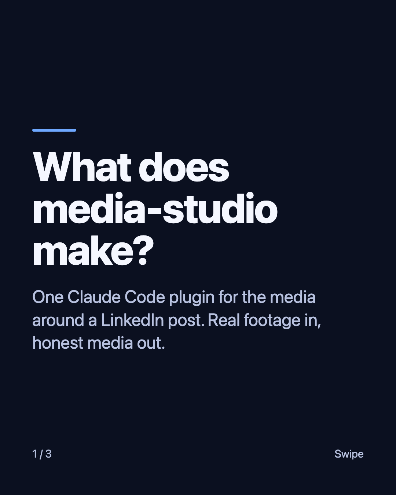
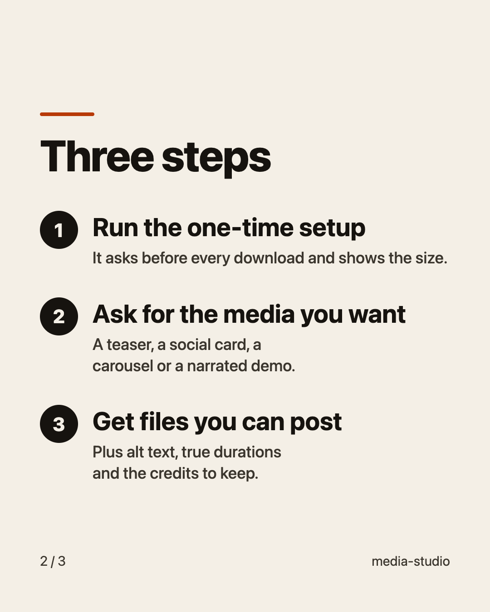
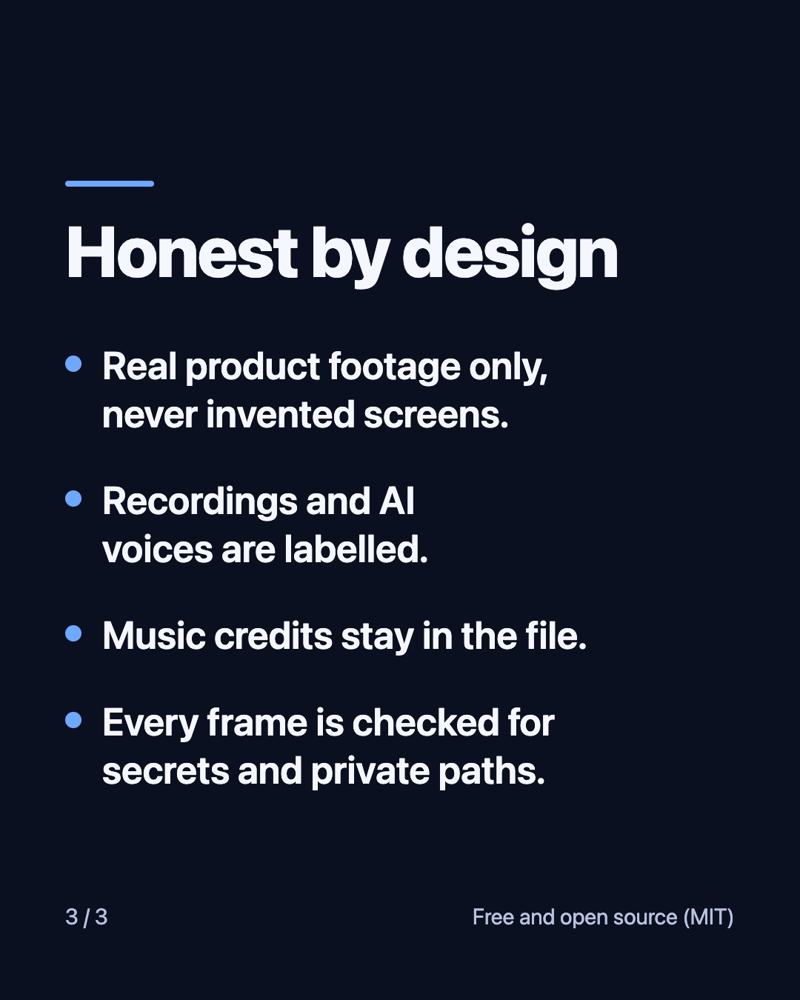

# media-studio

A [Claude Code](https://claude.com/claude-code) plugin that makes **honest, LinkedIn-ready media** from your real
work: launch teasers with music, videos made from code, narrated product demos, social cards, carousels and website
heroes. You describe what you want in plain words; Claude plans it, builds it on your computer, looks at the result,
and hands you the files with alt text and credits.

Real footage in, honest media out: it only shows your real product, labels recordings and AI voices, keeps music
credits, and checks every frame for secrets before it gives you anything. It never posts anything for you.

These are real outputs from this plugin's own smoke tests (made by the plugin, with the plugin as the subject):

| Social card (1200x630) | Teaser, one frame every 0.5 s (6 s, 1080x1080, music on the beat) |
|---|---|
|  |  |

| Carousel PDF, page 1 | page 2 | page 3 |
|---|---|---|
|  |  |  |

## What it can make

| You say | You get |
|---|---|
| "Make a 20 second launch teaser for my project" / "brag about this" | MP4 with music cut on the beat, poster frame, share copy |
| "Make a video from code: an animated explainer of ..." | MP4 rendered with Remotion |
| "Make a narrated demo of my app" | 16:9 demo plus a 30 s vertical cut, captions, voiceover (optional) |
| "Make a LinkedIn image / carousel / social card for my post" | PNG or a PDF document post, alt text |
| "Make a scroll-driven hero for my landing page" | a real HTML page built with the scroll-craft method |
| "Make the media for my LinkedIn post" | files plus `media.json` for your post-writing tool |

Works from a project folder, an app you can run, or any website URL.

## Install (3 commands)

You need [Claude Code](https://claude.com/claude-code) and [Node.js](https://nodejs.org) 18 or newer.

```text
/plugin marketplace add hharsha98/media-studio
/plugin install media-studio@media-studio-marketplace
/media-studio:setup
```

The second command also installs the official **Remotion** skills it depends on (the marketplace lists them, pinned to an
audited commit). If your Claude Code is too old to install dependencies automatically, run
`/plugin install remotion@media-studio-marketplace` once.

The same from a terminal: `claude plugin marketplace add hharsha98/media-studio`, then
`claude plugin install media-studio@media-studio-marketplace`. Then open Claude Code and run `/media-studio:setup`.

Then just ask: *"Use media-studio to make a 20 second teaser for this project."* Run `/media-studio:check` any time to see
what is ready.

## What `/media-studio:setup` installs, and how big it is

Everything goes into one folder, `~/MediaStudio` (set `MEDIA_STUDIO_HOME` to change it). **Nothing is installed globally.**
Setup shows the size before every download and asks first.

| What | Size | Why |
|---|---|---|
| playwright-core | 13 MB | draws still images in your Chrome or Edge (it downloads no browser) |
| Remotion project (exact versions) | about 250 MB on disk | renders videos |
| Chrome Headless Shell (from Remotion) | 171 MB download, about 570 MB on disk | the browser Remotion renders with |
| Music: 5 tracks by Sascha Ende | 12.4 MB | bundled soundtrack (CC BY 4.0, credit kept) |
| Beat files and sound-effects guide | 0.7 MB | cut on the beat |
| 260 sound effects | 2.5 MB | clicks, hits, keys (CC0) |

About 0.9 GB in total. Music, beat files and sound effects are **not stored in this repository**: setup downloads them from
the pinned upstream commit of [latent-spaces/brag](https://github.com/latent-spaces/brag) and refuses any file whose SHA-256 differs
from the hashes in `assets-manifest.json`. Re-running setup is safe; finished steps are skipped.

## What it costs

- **The plugin: free.** Every default path runs on your own computer and spends no money.
- **Remotion** is free for individuals and companies of up to 3 people; larger companies need a
  [company licence](https://www.remotion.pro/license).
- **Claude usage** comes from your own plan.
- **Optional paid items are never used without your yes:** kie.ai image or video generation (website flow), or any hosted voice API.
- **Narration** is optional and free with the [VoiceStudio](https://github.com/debpalash/VoiceStudio) app (you install it
  yourself) or your own recording. Default voice: **"Aiden"** (Qwen3-TTS, Apache-2.0), directed as a warm, confident
  presenter; lighter option: Kokoro's "Bella". Both are commercially usable; see `flows/voice.md`.

## Privacy

- Everything is made locally. Nothing is uploaded and nothing is posted.
- Network use, all visible in the scripts: npm (packages), Remotion's own download (the browser), `raw.githubusercontent.com`
  (the music and sound files, hash-checked), websites you ask it to capture, and VoiceStudio on `127.0.0.1` if you use it.
- Before delivering, Claude checks every frame and image for keys, emails, home-folder paths and customer data.
- It does not read `.env` files or credentials. Website captures never click, type or log in.

## Platforms

Written to work the same on **macOS, Windows and Linux** (Node scripts only; Remotion's bundled ffmpeg; your installed Chrome or Edge,
or Remotion's browser). Tested so far: macOS on Apple silicon. Windows and Linux are written for but not yet tested: tell me
what breaks. Linux needs a few system libraries for Remotion's browser (see `flows/setup.md`). The website flow also needs a
full system ffmpeg.

## How it is organised

```text
.claude-plugin/marketplace.json            lists media-studio and the official Remotion plugin (pinned)
plugins/media-studio/
  .claude-plugin/plugin.json
  commands/setup.md, check.md              /media-studio:setup  /media-studio:check
  skills/media-studio/
    SKILL.md                               the router (what to do for each request)
    flows/                                 teaser, video, demo, stills, web, voice, linkedin, setup
    scripts/                               setup, check, still, media, capture, speak, encode (Node)
    templates/remotion/                    pinned Remotion project (copied to your workspace)
    vendor/brag/, vendor/scroll-craft/     MIT method text and scripts (no music, no sound files)
    assets-manifest.json                   SHA-256 hashes of the files setup downloads
docs/PLUGIN-FORMAT.md                      the plugin format this repo was checked against
THIRD_PARTY_NOTICES.md                     every third-party source, licence, commit and URL
```

## LinkedIn handoff

Each run writes `out/media.json` (path, kind, size, duration, alt text, credits, LinkedIn limits and warnings). A post-writing
tool such as the `linkedin-skills` plugin can read it, or you attach the files by hand. Details, limits and what is known
about uploading through a scheduler: `plugins/media-studio/skills/media-studio/flows/linkedin.md`.

## Licences and credits

This repository is MIT (see `LICENSE`). It vendors MIT text from
[latent-spaces/brag](https://github.com/latent-spaces/brag) (teaser method) and scroll-craft (Nate Herk), and depends on the official
[Remotion](https://github.com/remotion-dev/claude-code-plugin) skills without copying them. Music: Sascha Ende
([ende.app](https://ende.app/en)), CC BY 4.0; sound effects CC0. Full list: `THIRD_PARTY_NOTICES.md`.

## For contributors

```text
claude plugin validate . --strict                      # marketplace
claude plugin validate ./plugins/media-studio --strict # plugin
claude plugin marketplace add ./  &&  claude plugin install media-studio@media-studio-marketplace   # local test
node tools/build-assets-manifest.mjs <brag checkout>   # rebuild hashes after bumping the pinned commit
```
